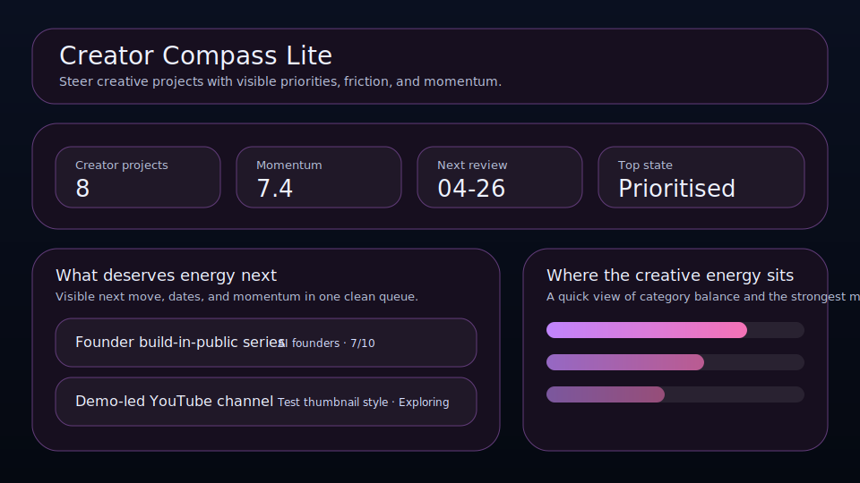

# Creator Compass Lite

Steer creative projects with visible priorities, friction, and momentum.



Creator Compass Lite is a local-first workspace for founders, operators, and solo builders who want a cleaner way to manage creator projects. It keeps momentum, audience, next move, and review timing visible so the right things move forward with less drift.

## What it does

- ranks creator projects by leverage, momentum, timing, and friction
- tracks **audience**, **next move**, **review date**, and **momentum** for each creator project
- highlights the best current bet, the next review slot, and the strongest signal on the board
- renders a dedicated queue plus a category mix snapshot beneath the main board
- saves locally in the browser with JSON import/export backups
- quick action: **Go active**
- quick action: **Raise momentum**
- quick action: **Mark published**

## Why it feels different

Creator Compass Lite is not just a generic list. It is shaped around the real workflow behind creator projects, so the board helps you decide what matters next instead of simply storing records.

## Quick start

```bash
git clone https://github.com/get2salam/creator-compass-lite.git
cd creator-compass-lite
python -m http.server 8000
```

Then open <http://localhost:8000>.

## Keyboard shortcuts

- `N` creates a new creator project
- `/` focuses the search box

## Privacy

Everything stays in your browser unless you export a JSON backup.

## Validating a backup

JSON backups can drift if you hand-edit them or restore from an older copy.
Before re-importing one, run the local validator to confirm it still matches the
`creator-compass-lite/v3` schema:

```bash
node scripts/check-backup.mjs path/to/backup.json
```

The script exits `0` when the file is valid, `1` with a list of specific
problems (wrong schema, oversized item lists, out-of-range scores, malformed
dates, duplicate ids, or broken saved UI state) when it is not, and `2` when the
path is missing or unreadable, so it composes cleanly with shell pipelines and CI.

Run `node --test scripts/check-backup.test.mjs` to execute the bundled
`node:test` suite that exercises the validator.

## Scoring board focus

For a quick deterministic audit of a saved board, run:

```bash
npm run audit:board -- path/to/backup.json --today 2026-04-24
```

The scorer validates the backup, grades the active creator queue from 0-100,
and prints concrete findings for overdue reviews, weak momentum on high-upside
projects, or friction-heavy work. It exits non-zero when the backup is invalid
or the score falls below 70, which makes it useful for lightweight agent/eval
checks before restoring or sharing a board.

## Local verification

This repo has a dependency-free verification command for CI and local review:

```bash
npm run verify
```

It checks that `index.html` still wires the roles, fields, import/export controls,
stylesheet, and module script required by `js/main.js`, then runs the backup
validator test suite. Use `npm run check:app` when you only want the static app
contract check.

## License

MIT
